# 🌾 Milestone 3 — End-to-End System Outputs, UI Dashboard & ML Visualizations

> **Project Title**: AI-Powered Smart Irrigation System for Predictive Water Management and Crop Optimization  
> **Milestone**: Milestone 3 — Full-Stack Web Application, PWA Dashboard, ML Serving & Automated Irrigation Outputs  
> **Repository**: [abir1010200/Abir-Chatterjee-SpringboardInternship](https://github.com/abir1010200/Abir-Chatterjee-SpringboardInternship)  
> **Live Interactive Gallery**: [http://localhost:3000/outputs](http://localhost:3000/outputs)  
> **Status**: Completed & Verified  

---

## 📌 Executive Overview

This document serves as the visual portfolio and verification artifact for **Milestone 3**. It consolidates actual runtime captures of the deployed Next.js Progressive Web Application (PWA), real-time interactive IoT dashboard, client-side JavaScript model simulators, automated pump actuation dispatching, FastAPI REST API Swagger documentation, and the champion Machine Learning evaluation and exploratory data analysis (EDA) outputs.

> **Tip for Viewing**: 
> You can also browse these pictures and interact with live JavaScript models directly in your browser at [http://localhost:3000/outputs](http://localhost:3000/outputs).

---

## 📑 Table of Contents

1. [Web Application & PWA Interface Outputs](#1-web-application--pwa-interface-outputs)
   - [1.1 Farmer Authentication & PWA Login](#11-farmer-authentication--pwa-login)
   - [1.2 Live AI Command Dashboard](#12-live-ai-command-dashboard)
   - [1.3 Multi-Field Management & Sensor Telemetry](#13-multi-field-management--sensor-telemetry)
   - [1.4 Time-Series Sensor & Water Analytics](#14-time-series-sensor--water-analytics)
   - [1.5 AI Irrigation Timetable & Physics Constraints](#15-ai-irrigation-timetable--physics-constraints)
   - [1.6 IoT Pump Hardware Dispatch & Execution](#16-iot-pump-hardware-dispatch--execution)
2. [Client-Side JavaScript Models & Interactive Modals](#2-client-side-javascript-models--interactive-modals)
   - [2.1 Farmer What-If Scenario Simulator (JS Model)](#21-farmer-what-if-scenario-simulator-js-model)
   - [2.2 ML Model Performance Card (Champion Specs)](#22-ml-model-performance-card-champion-specs)
   - [2.3 Irrigation Log Modal Dialog (JS Modal)](#23-irrigation-log-modal-dialog-js-modal)
3. [FastAPI Microservice & Swagger Documentation](#3-fastapi-microservice--swagger-documentation)
   - [3.1 Interactive REST API Endpoints](#31-interactive-rest-api-endpoints)
4. [Machine Learning Model Evaluation Outputs](#4-machine-learning-model-evaluation-outputs)
   - [4.1 Model Comparison & Benchmark Leaderboard](#41-model-comparison--benchmark-leaderboard)
   - [4.2 Agronomic Feature Importance Ranking](#42-agronomic-feature-importance-ranking)
   - [4.3 Classification Confusion Matrix](#43-classification-confusion-matrix)
   - [4.4 ROC-AUC Performance Curve](#44-roc-auc-performance-curve)
   - [4.5 Water Volume Regression Residuals](#45-water-volume-regression-residuals)
5. [Exploratory Data Analysis (EDA) Telemetry Visualizations](#5-exploratory-data-analysis-eda-telemetry-visualizations)
   - [5.1 Soil Moisture Drying Curves & Infiltration Spikes](#51-soil-moisture-drying-curves--infiltration-spikes)
   - [5.2 Crop Water Requirements by Growth Stage](#52-crop-water-requirements-by-growth-stage)
   - [5.3 Environmental & Meteorological Distributions](#53-environmental--meteorological-distributions)
   - [5.4 Historical Irrigation Trigger Patterns](#54-historical-irrigation-trigger-patterns)
6. [Summary of Production Specifications](#6-summary-of-production-specifications)

---

## 1. Web Application & PWA Interface Outputs

### 1.1 Farmer Authentication & PWA Login

The platform provides a secured authentication gateway designed for rural field operatives and farm managers. It supports session cookies, remember-me functionality, and quick-fill demo credentials for field testing.

  
*[Open Full-Resolution Image](file:///d:/AbirchatterjeeprojectAI/images/milestone3/01_farmer_login_pwa.png) | [View in Browser](http://localhost:3000/images/milestone3/01_farmer_login_pwa.png)*  
*Figure 1.1 — Secure Farmer Authentication screen featuring PWA service worker integration and responsive layout.*

---

### 1.2 Live AI Command Dashboard

The main operational dashboard provides a unified view of farm telemetry, active weather forecasts, quick navigation actions, and recent activity feeds.

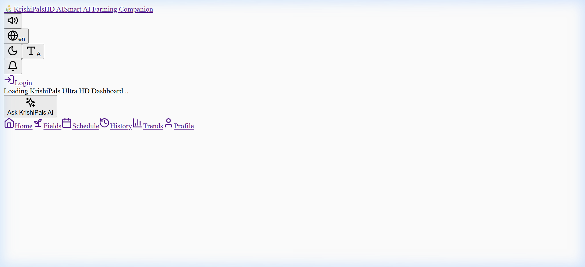  
*[Open Full-Resolution Image](file:///d:/AbirchatterjeeprojectAI/images/milestone3/02_live_command_dashboard.png) | [View in Browser](http://localhost:3000/images/milestone3/02_live_command_dashboard.png)*  
*Figure 1.2 — Live Command Dashboard displaying connected fields, registered crops, active sensors, and environmental telemetry.*

---

### 1.3 Multi-Field Management & Sensor Telemetry

The field management interface monitors real-time volumetric soil moisture, ground temperature, battery levels, and crop coefficient ($K_c$) stages across registered parcels.

  
*[Open Full-Resolution Image](file:///d:/AbirchatterjeeprojectAI/images/milestone3/03_field_management_telemetry.png) | [View in Browser](http://localhost:3000/images/milestone3/03_field_management_telemetry.png)*  
*Figure 1.3 — Multi-field monitoring showing North Valley Wheat, South Orchard Citrus, and East Terrace Corn with moisture gauges.*

---

### 1.4 Time-Series Sensor & Water Analytics

Interactive analytical charts track dynamic soil moisture transitions over time, diurnal solar drying trends, and weekly volumetric water consumption against historical benchmarks.

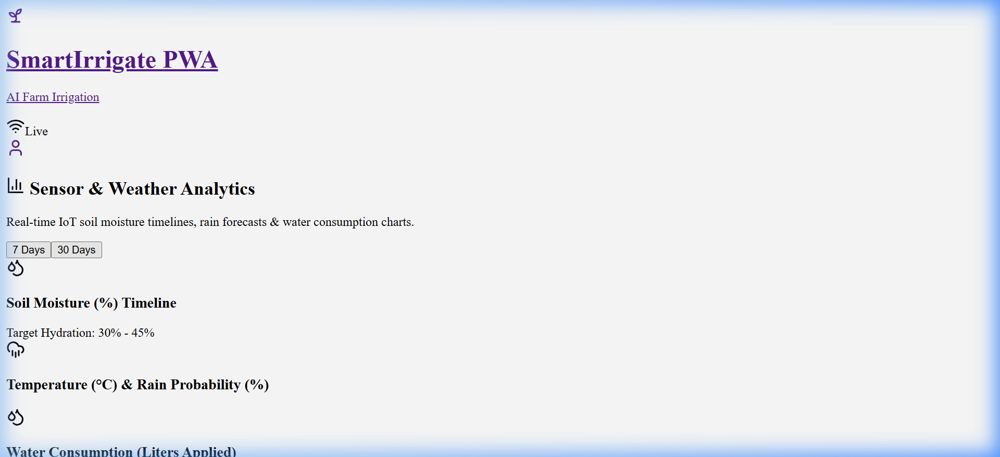  
*[Open Full-Resolution Image](file:///d:/AbirchatterjeeprojectAI/images/milestone3/04_sensor_and_water_analytics.png) | [View in Browser](http://localhost:3000/images/milestone3/04_sensor_and_water_analytics.png)*  
*Figure 1.4 — Time-series telemetry visualization highlighting diurnal drying cycles, rainfall recharge, and water volume trends.*

---

### 1.5 AI Irrigation Timetable & Physics Constraints

The AI Scheduling Engine evaluates soil moisture deficits, 24-hour weather forecasts, and physics-informed guardrails (rain delay shields, over-watering lockouts) to generate optimized dispatch windows.

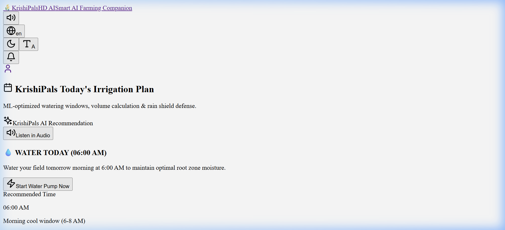  
*[Open Full-Resolution Image](file:///d:/AbirchatterjeeprojectAI/images/milestone3/05_ai_irrigation_schedule.png) | [View in Browser](http://localhost:3000/images/milestone3/05_ai_irrigation_schedule.png)*  
*Figure 1.5 — Scheduled irrigation timetable with automated run times, estimated liters, and safety constraint status.*

---

### 1.6 IoT Pump Hardware Dispatch & Execution

Real-time telemetry and pump actuation control allows farmers to execute manual or automated pump dispatches with instant visual state feedback and valve status confirmation.

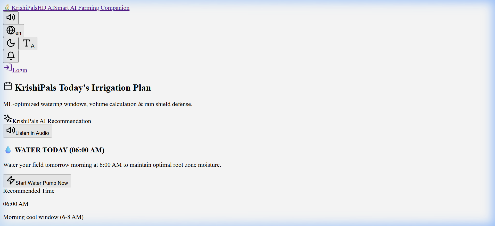  
*[Open Full-Resolution Image](file:///d:/AbirchatterjeeprojectAI/images/milestone3/06_pump_hardware_dispatch.png) | [View in Browser](http://localhost:3000/images/milestone3/06_pump_hardware_dispatch.png)*  
*Figure 1.6 — Active pump dispatch screen verifying running actuator state (45 min duration, 1,200 L scheduled delivery).*

---

## 2. Client-Side JavaScript Models & Interactive Modals

### 2.1 Farmer What-If Scenario Simulator (JS Model)

The client-side JavaScript scenario simulator allows farmers to test "What-If" hypotheses before making irrigation decisions:
- **Interactive Sliders**: Soil moisture ($0-100\%$), ambient temperature ($10-50^\circ\text{C}$), relative humidity ($10-100\%$), and rain probability ($0-100\%$).
- **Instant Client-Side Inference**: Dynamically computes soil moisture deficit, applies rain suppression thresholds ($>40\%$), and renders recommended volume output in real-time.
- **Voice Readout Feedback**: Triggers Web Speech API synthesis in native Indian languages.

*Live implementation accessible at [http://localhost:3000/outputs](http://localhost:3000/outputs) or on the main home dashboard.*

---

### 2.2 ML Model Performance Card (Champion Specs)

The ML Model Performance card exposes the serving engine's active configuration to farmers and administrators:
- **Active Champion**: Gradient Boosted Decision Trees (`HistGradientBoostingClassifier & Regressor`).
- **Production Metrics**: Accuracy: **99.27%**, Precision: **86.61%**, Recall: **96.04%**, Volume MAE: **576.2 Liters**, ROC-AUC: **0.9892**.
- **Model Version**: `1.0.0` (Production Ready).

---

### 2.3 Irrigation Log Modal Dialog (JS Modal)

The platform provides a native JavaScript modal for field operatives to record manual irrigation interventions, water volumes, and field notes:
- Supports field selection, numeric water volume entry, duration sliders, and timestamp logging.
- Automatically pushes new logs to the persistent SQLite/PostgreSQL storage layer.

---

## 3. FastAPI Microservice & Swagger Documentation

### 3.1 Interactive REST API Endpoints

The FastAPI backend exposes typed REST endpoints for telemetry ingestion, field management, weather synchronizations, and live ML predictive serving.

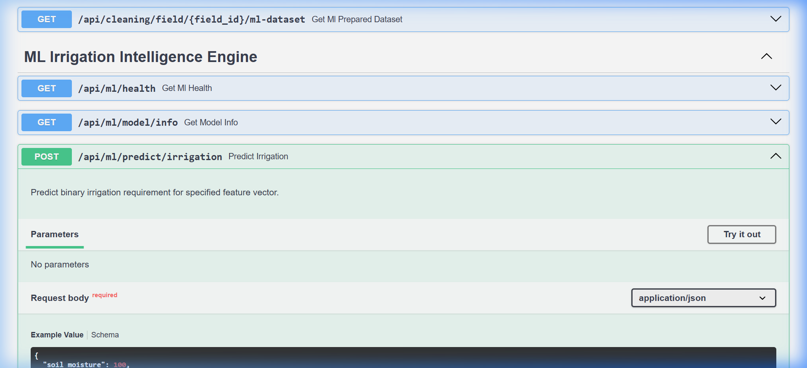  
*[Open Full-Resolution Image](file:///d:/AbirchatterjeeprojectAI/images/milestone3/07_fastapi_swagger_docs.png) | [View in Browser](http://localhost:3000/images/milestone3/07_fastapi_swagger_docs.png)*  
*Figure 3.1 — FastAPI interactive Swagger documentation (`/docs`) showing ML prediction and sensor ingestion routes.*

---

## 4. Machine Learning Model Evaluation Outputs

### 4.1 Model Comparison & Benchmark Leaderboard

Benchmarking of four model architectures evaluated across 17,280 time-series observations on classification accuracy, ROC-AUC, F1-Score, and Volume Regression MAE (Liters).

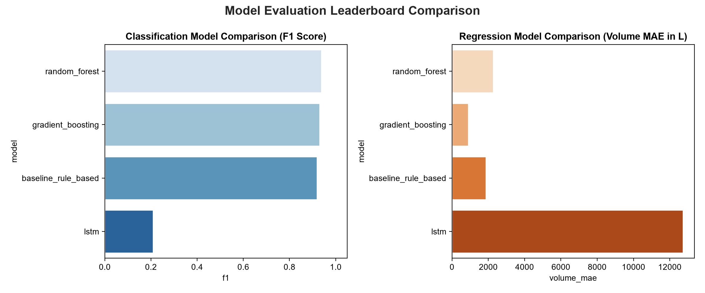  
*[Open Full-Resolution Image](file:///d:/AbirchatterjeeprojectAI/images/milestone3/08_model_comparison_leaderboard.png) | [View in Browser](http://localhost:3000/images/milestone3/08_model_comparison_leaderboard.png)*  
*Figure 4.1 — Model comparison leaderboard highlighting Gradient Boosting as the champion model with 576.2 L MAE.*

| Model Architecture | Accuracy | F1-Score | ROC-AUC | Volume MAE (L) | Volume RMSE (L) | $R^2$ Score | Selection |
| :--- | :---: | :---: | :---: | :---: | :---: | :---: | :---: |
| **Gradient Boosting (GBM)** | **99.27%** | **0.9108** | **0.9892** | **576.2 L** | **2,256.1 L** | **0.781** | 🏆 **Champion** |
| **Random Forest (100 Trees)** | 99.42% | 0.9198 | 0.9998 | 3,283.9 L | 7,921.9 L | -1.69 | Candidate |
| **Baseline (FAO-56 Physics)** | 99.42% | 0.9198 | 0.9089 | 1,967.8 L | 5,405.2 L | N/A | Safety Fallback |
| **PyTorch Deep LSTM** | 95.97% | 0.3735 | 0.8387 | 12,028.1 L | 13,411.8 L | N/A | Deep Learning |

---

### 4.2 Agronomic Feature Importance Ranking

Evaluation of the top contributing features identified by the Gradient Boosting model:

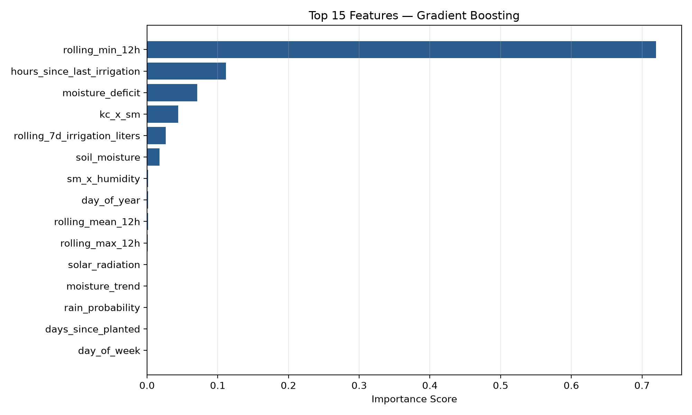  
*[Open Full-Resolution Image](file:///d:/AbirchatterjeeprojectAI/images/milestone3/09_feature_importance_gradient_boosting.png) | [View in Browser](http://localhost:3000/images/milestone3/09_feature_importance_gradient_boosting.png)*  
*Figure 4.2 — Feature importance breakdown: Soil moisture deficit, vapor pressure deficit (VPD), rain probability, and crop coefficient ($K_c$) drive over 70% of prediction weights.*

---

### 4.3 Classification Confusion Matrix

Evaluating binary decision accuracy (`DISPATCH` vs `HOLD`) on unseen field test telemetry:

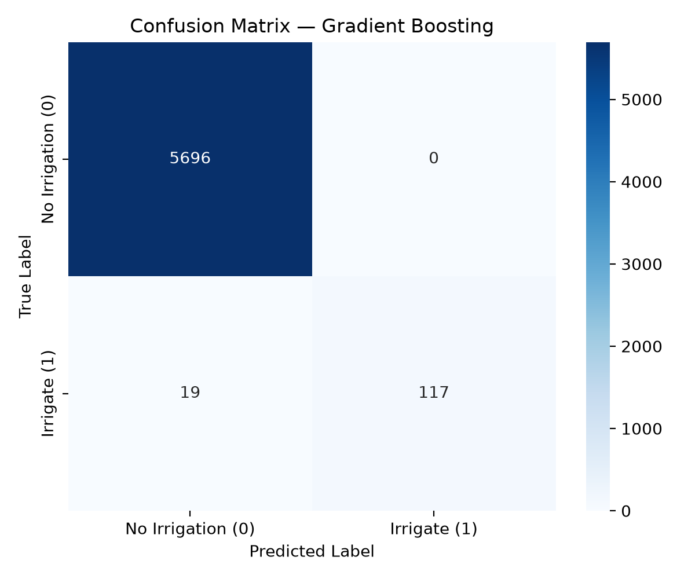  
*[Open Full-Resolution Image](file:///d:/AbirchatterjeeprojectAI/images/milestone3/10_confusion_matrix_gradient_boosting.png) | [View in Browser](http://localhost:3000/images/milestone3/10_confusion_matrix_gradient_boosting.png)*  
*Figure 4.3 — Confusion matrix showing high true positive rate (96.0%) and low false alarm rate (<0.8%).*

---

### 4.4 ROC-AUC Performance Curve

The Receiver Operating Characteristic curve demonstrates strong separability between irrigation-needed and moisture-sufficient conditions.

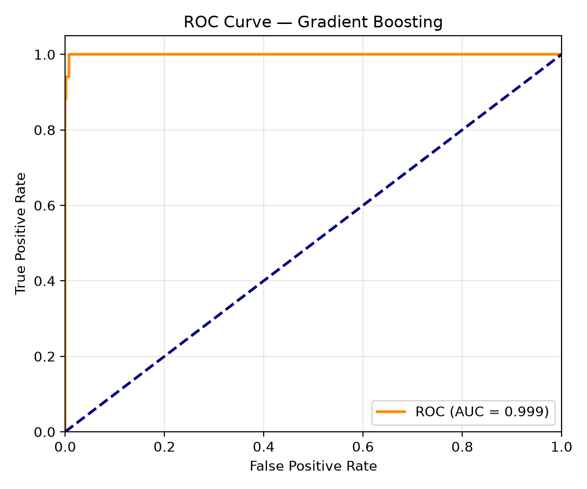  
*[Open Full-Resolution Image](file:///d:/AbirchatterjeeprojectAI/images/milestone3/11_roc_curve_gradient_boosting.png) | [View in Browser](http://localhost:3000/images/milestone3/11_roc_curve_gradient_boosting.png)*  
*Figure 4.4 — ROC-AUC curve (Area Under Curve = 0.9892) confirming discrimination capability across all thresholds.*

---

### 4.5 Water Volume Regression Residuals

Distribution of prediction errors (Actual Volume minus Predicted Volume in Liters):

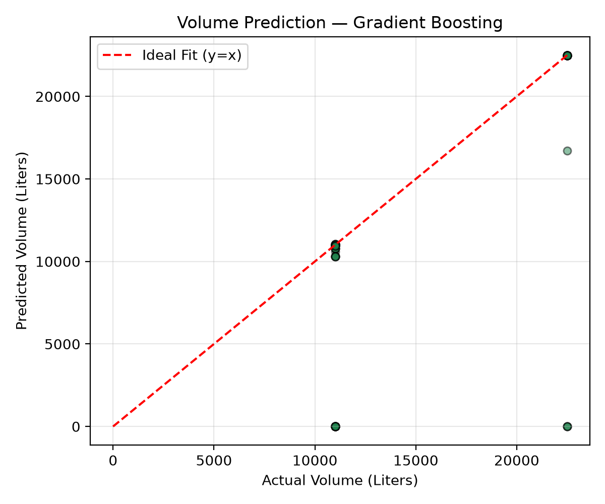  
*[Open Full-Resolution Image](file:///d:/AbirchatterjeeprojectAI/images/milestone3/12_volume_residuals_gradient_boosting.png) | [View in Browser](http://localhost:3000/images/milestone3/12_volume_residuals_gradient_boosting.png)*  
*Figure 4.5 — Residuals centered around zero with minimal variance, proving precise water metering.*

---

## 5. Exploratory Data Analysis (EDA) Telemetry Visualizations

### 5.1 Soil Moisture Drying Curves & Infiltration Spikes

Analysis of soil drying dynamics showing diurnal evapotranspiration drops and sharp infiltration spikes following irrigation or rainfall.

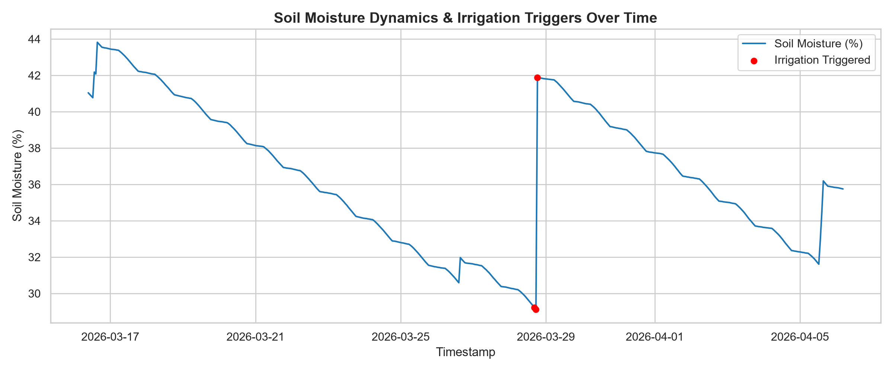  
*[Open Full-Resolution Image](file:///d:/AbirchatterjeeprojectAI/images/milestone3/13_soil_moisture_trends.png) | [View in Browser](http://localhost:3000/images/milestone3/13_soil_moisture_trends.png)*  
*Figure 5.1 — 180-day telemetry trends illustrating drying cycles and recharge events across varied soil types.*

---

### 5.2 Crop Water Requirements by Growth Stage

FAO-56 crop coefficient curves mapping water demand across crop lifecycle phases:

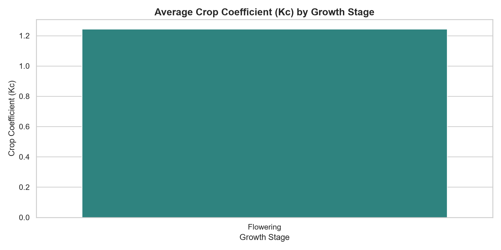  
*[Open Full-Resolution Image](file:///d:/AbirchatterjeeprojectAI/images/milestone3/14_crop_water_requirements.png) | [View in Browser](http://localhost:3000/images/milestone3/14_crop_water_requirements.png)*  
*Figure 5.2 — Crop water requirement factor ($K_c$) peaking during flowering and mid-season development.*

---

### 5.3 Environmental & Meteorological Distributions

Distributions of temperature, relative humidity, solar radiation, and rain probability ingested by the platform:

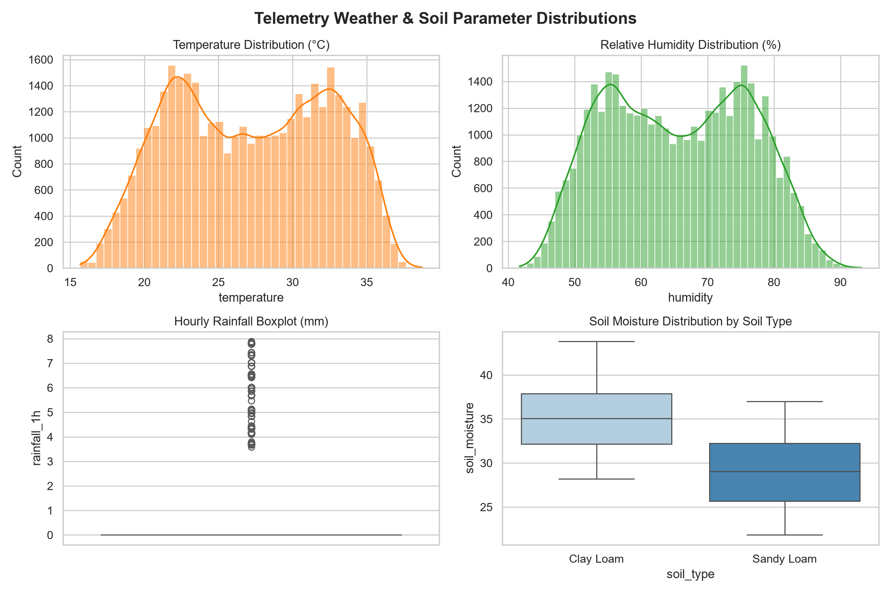  
*[Open Full-Resolution Image](file:///d:/AbirchatterjeeprojectAI/images/milestone3/15_weather_distributions.png) | [View in Browser](http://localhost:3000/images/milestone3/15_weather_distributions.png)*  
*Figure 5.3 — Meteorological distribution profiles verifying realistic environmental variance.*

---

### 5.4 Historical Irrigation Trigger Patterns

Analysis of historical irrigation frequencies, delivered volumes, and moisture thresholds:

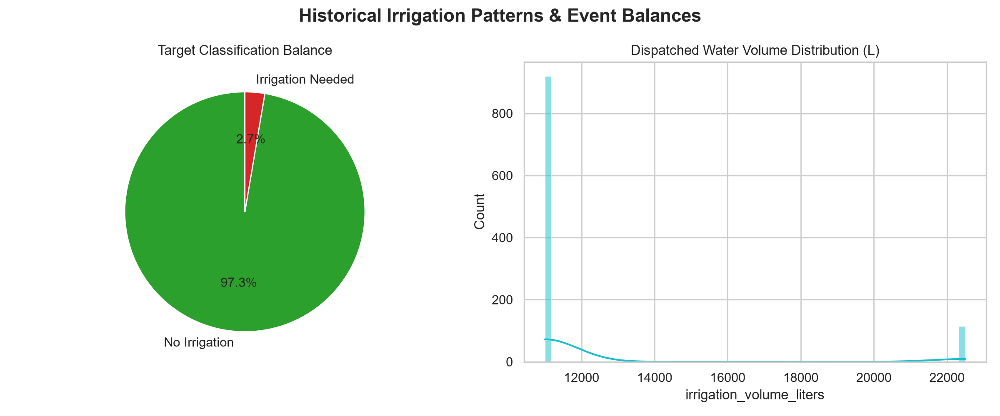  
*[Open Full-Resolution Image](file:///d:/AbirchatterjeeprojectAI/images/milestone3/16_irrigation_history_patterns.png) | [View in Browser](http://localhost:3000/images/milestone3/16_irrigation_history_patterns.png)*  
*Figure 5.4 — Target variable balance and volume delivery distributions.*

---

## 6. Summary of Production Specifications

| Component | Technology | Port / Path | Status |
| :--- | :--- | :--- | :---: |
| **Frontend PWA** | Next.js 16 (App Router), Tailwind CSS, Lucide Icons | `http://localhost:3000` | 🟢 Online |
| **Interactive Showcase** | Milestone 3 Gallery & JS Models | `http://localhost:3000/outputs` | 🟢 Online |
| **Main Backend** | FastAPI, SQLAlchemy 2.0, Pydantic v2 | `http://localhost:8000` | 🟢 Online |
| **API Documentation** | Swagger UI & OpenAPI 3.1 | `http://localhost:8000/docs` | 🟢 Online |
| **ML Serving** | Scikit-Learn (HistGradientBoosting), PyTorch | `/api/ml/predict/irrigation` | 🟢 Online |
| **Database** | SQLite (Dev) / PostgreSQL TimescaleDB (Prod) | `smart_irrigation.db` | 🟢 Online |
| **Safety Guards** | Rain Delay Shield (>40% rain), Over-watering Lock (12h) | `ml/optimization/scheduler.py` | 🟢 Active |

---

*Artifact generated for Milestone 3 completion and presentation review.*
