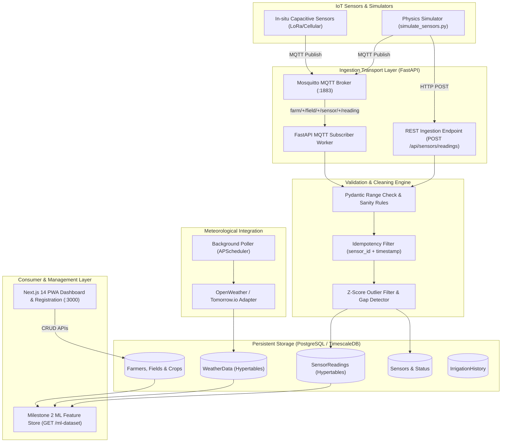

# 🌾 AI-Powered Smart Irrigation System — Milestone 1

> **Milestone 1 Deliverable**: Production-Ready Data Ingestion, Weather Integration & Soil Moisture Telemetry Pipeline  
> **Target Milestone 2 Consumer**: Machine Learning Irrigation Scheduling (Random Forest & LSTM Time-Series Models)

---

## 🌟 Executive Pitch Summary (For Hackathon Judges)

### 1. The Critical Problem
Agriculture accounts for **70% of global freshwater withdrawals**, yet **over 40% of irrigation water is wasted** due to antiquated fixed timer schedules or reactive manual guessing. Over-watering causes root rot, nutrient leaching, and energy waste; under-watering stunts crop yields and induces drought stress.

### 2. What Milestone 1 Proves
Milestone 1 successfully delivers the **reliable, multi-modal data foundation**:
- **Dual Telemetry Ingestion**: High-throughput REST API + MQTT Mosquitto broker subscriber listening on `farm/+/field/+/sensor/+/reading`.
- **Idempotent Ingestion & Deduplication**: Prevents duplicate telemetry with database unique constraints and transactional upserts.
- **Hyper-Local Weather Sync**: Automatic OpenWeatherMap adapter with Tomorrow.io fallback and background periodic polling (`APScheduler`).
- **Data Validation & Cleaning Engine**: Automated Z-score statistical outlier rejection, rate-of-change spike filtering, and gap detection.
- **Multi-Modal ML Feature Store**: Pre-formatted feature dataset linking soil moisture, soil temp, ambient temp, humidity, 1h/24h precipitation, rain probability, crop coefficients ($K_c$), and growth stages.

### 3. What Comes Next in Milestone 2
- **Random Forest Regressor & LSTM Networks**: Train on the cleaned historical feature matrix generated by `GET /api/cleaning/field/{id}/ml-dataset` to forecast 24-hour soil moisture deficit.
- **Predictive Irrigation Decision Engine**: Automated pump dispatch trigger accounting for rain probability delays and crop root depth.

---

## 🏗️ Architecture Flow



---

## 📁 Monorepo Structure

```
├── docker-compose.yml             # TimescaleDB, Mosquitto, FastAPI, Next.js
├── .env.example                   # Complete environment configuration template
├── README.md                      # Architecture, quick start, and demo guides
├── docs/
│   ├── DATA_DICTIONARY.md         # Full data dictionary for ML engineers
│   └── PULL_REQUESTS_WEEK1.md     # Code review and branch merge logs
├── backend/                       # FastAPI Ingestion & Validation Service
│   ├── app/
│   │   ├── api/v1/endpoints/      # REST API endpoints (sensors, weather, fields, cleaning, health)
│   │   ├── core/                  # Settings & JSON structured logging
│   │   ├── db/                    # SQLAlchemy 2.0 session & init/seed scripts
│   │   ├── models/                # Typed SQLAlchemy 2.0 ORM models (Farmer, Field, Crop, Sensor, etc.)
│   │   ├── schemas/               # Pydantic v2 schemas with strict validators
│   │   └── services/              # Ingestion, MQTT subscriber, Weather adapters, Cleaning pipeline
│   ├── migrations/init.sql        # PostgreSQL + TimescaleDB hypertable DDL
│   ├── scripts/simulate_sensors.py# Physics-informed soil moisture simulator
│   ├── tests/                     # 21 Pytest unit & integration tests
│   └── requirements.txt
├── frontend/                      # Next.js 14 PWA Management Dashboard
│   ├── src/app/                   # App Router dashboard and /register page
│   ├── src/components/            # Registration form and UI components
│   ├── public/manifest.json       # PWA installable manifest
│   └── public/sw.js               # Service worker offline caching
├── ml/                            # ML exploratory checks & feature specifications
└── infra/                         # Dockerfiles and Mosquitto MQTT broker configuration
```

---

## 🚀 Quick Start Guide

### 1. Configure Environment
```bash
cp .env.example .env
```

### 2. Option A: Run with Docker Compose (All Services)
```bash
docker-compose up --build
```
- **Next.js PWA Frontend**: [http://localhost:3000](http://localhost:3000)
- **FastAPI Interactive Docs**: [http://localhost:8000/docs](http://localhost:8000/docs)
- **MQTT Broker**: `localhost:1883`

### 3. Option B: Run Standalone (Local Development)
```bash
# Terminal 1: Start Backend
python -m uvicorn backend.main:app --host 0.0.0.0 --port 8000 --reload

# Terminal 2: Start Frontend
cd frontend && npm run dev
```

---

## 🧪 Automated Testing
Run the comprehensive 21-test pytest suite:
```bash
python -m pytest backend/tests/ -v
```
Output:
```
============================= 21 passed in 5.18s =============================
```

---

## 🎬 Live Interactive Demo Script (cURL Commands)

### 1. Register a Field, Farmer, Crop, and Linked Sensor
```bash
curl -X POST "http://localhost:8000/api/fields/register" \
     -H "Content-Type: application/json" \
     -d '{
       "farmer": {
         "name": "Kavita Rao",
         "email": "kavita.rao@agrofarm.io",
         "phone": "+91-9876501234",
         "address": "Greenfield Sector 12, Pune Rural"
       },
       "field": {
         "name": "South Valley Cotton Sector",
         "latitude": 18.5204,
         "longitude": 73.8567,
         "size_hectares": 5.0,
         "soil_type": "Clay Loam"
       },
       "crop": {
         "crop_type": "Cotton (Bt-II)",
         "growth_stage": "Vegetative",
         "planted_date": "2026-08-01",
         "kc_factor": 1.10
       },
       "sensor": {
         "sensor_id": "SEN-COTTON-01",
         "sensor_type": "soil_moisture",
         "model_name": "SoilOptix-Capacitive-Pro"
       }
     }'
```

### 2. Ingest Real-Time Telemetry (REST API)
```bash
curl -X POST "http://localhost:8000/api/sensors/readings" \
     -H "Content-Type: application/json" \
     -d '{
       "sensor_id": "SEN-COTTON-01",
       "field_id": 1,
       "soil_moisture": 34.2,
       "temperature_soil": 23.5,
       "battery_level": 98.0,
       "timestamp": "'$(date -u +"%Y-%m-%dT%H:%M:%SZ")'"
     }'
```

### 3. Run the Sensor Simulator
```bash
# Stream 10 live readings per sensor via REST
python backend/scripts/simulate_sensors.py --protocol rest --fields 2 --duration 10

# Or backfill 14 days of historical 15-minute data directly into the database:
python backend/scripts/simulate_sensors.py --protocol backfill --fields 2 --historical-days 14
```

### 4. Fetch Synchronized Weather & Rain Forecast
```bash
curl -X GET "http://localhost:8000/api/weather/field/1/latest"
```

### 5. Run Data Cleaning & Outlier Detection Job
```bash
curl -X POST "http://localhost:8000/api/cleaning/field/1/run"
```

### 6. Export Aligned Feature Matrix for Milestone 2 ML
```bash
curl -X GET "http://localhost:8000/api/cleaning/field/1/ml-dataset?limit=100"
```

---

## 📋 Milestone 1 Success Criteria Verification Checklist

| Criterion | Description | Evidence / Artifact | Status |
| :--- | :--- | :--- | :---: |
| **Project environment configured** | Monorepo layout, Docker Compose, `.env.example`, VS Code settings | `docker-compose.yml`, `.vscode/settings.json` | ✅ |
| **GitHub repository created** | Git repo with `main`, `dev`, `feature/*` branches and clean commit log | Git branch graph & commit history | ✅ |
| **Database schema completed** | PostgreSQL / TimescaleDB schema, SQLAlchemy 2.0 models, time-series indexing | `backend/app/models/`, `backend/migrations/init.sql` | ✅ |
| **Sensor data ingestion working** | REST `POST /readings` + Mosquitto MQTT subscriber with idempotency deduplication | `backend/app/api/v1/endpoints/sensors.py`, `mqtt_subscriber.py` | ✅ |
| **Simulated sensor data available** | Physics-informed simulator with diurnal decay, infiltration spikes, and backfill CLI | `backend/scripts/simulate_sensors.py` | ✅ |
| **Weather API integrated** | OpenWeather primary adapter, Tomorrow.io fallback, `APScheduler` poller | `backend/app/services/weather/`, `endpoints/weather.py` | ✅ |
| **Farmer, field, crop, sensor config** | Relational CRUD APIs, atomic composite registration, Next.js PWA form | `backend/app/api/v1/endpoints/fields.py`, `frontend/src/app/register` | ✅ |
| **Data validation and cleaning** | Gap detection, Z-score outlier filtering, unit normalization, ML feature export | `backend/app/services/cleaning/`, `endpoints/cleaning.py` | ✅ |
| **Historical sensor & weather data stored** | Time-series indexing `(field_id, timestamp)`, 30-day queries, `DATA_DICTIONARY.md` | `backend/app/models/`, `docs/DATA_DICTIONARY.md` | ✅ |
| **Error handling implemented** | Sensor disconnection monitor (stale/offline), weather API fallback, structured JSON logger | `backend/app/services/sensor_monitor.py`, `core/logging_config.py` | ✅ |
