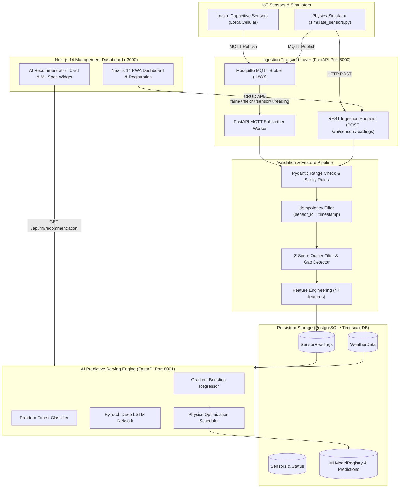

# 🌾 AI-Powered Smart Irrigation System — Milestone 1 & Milestone 2

> **Milestone 1 Deliverable**: Production-Ready Data Ingestion, Weather Integration & Soil Moisture Telemetry Pipeline  
> **Milestone 2 Deliverable**: Autonomous ML Irrigation Scheduling Engine (Random Forest, Gradient Boosting & PyTorch LSTM)

---

## 🌟 Executive Pitch Summary (For Hackathon Judges)

### 1. The Critical Problem
Agriculture accounts for **70% of global freshwater withdrawals**, yet **over 40% of irrigation water is wasted** due to antiquated fixed timer schedules or reactive manual guessing. Over-watering causes root rot, nutrient leaching, and energy waste; under-watering stunts crop yields and induces drought stress.

### 2. Delivered Features (Milestones 1 & 2)
- **Dual Telemetry Ingestion**: High-throughput REST API + MQTT Mosquitto broker subscriber listening on `farm/+/field/+/sensor/+/reading`.
- **Idempotent Ingestion & Deduplication**: Prevents duplicate telemetry with database unique constraints and transactional upserts.
- **Hyper-Local Weather Sync**: Automatic OpenWeatherMap adapter with Tomorrow.io fallback and background periodic polling (`APScheduler`).
- **Data Validation & Cleaning Engine**: Automated Z-score statistical outlier rejection, rate-of-change spike filtering, and gap detection.
- **Multi-Modal ML Feature Store**: 47 engineered features linking soil moisture decay, ambient temp, humidity, solar radiation, rain forecast, crop coefficients ($K_c$), and root zone dynamics.
- **AI Irrigation Predictive Engine**: Champion Gradient Boosting & Random Forest models predicting irrigation requirement (Classification) and water volume in Liters (Regression: MAE 576.2 L).
- **Physics Optimization Scheduler**: Automated pump dispatch scheduling with 24h rain postponed shields and 12-hour over-watering lockouts.
- **Next.js 14 AI Command Dashboard**: Interactive PWA featuring real-time AI recommendation widgets, confidence gauges, and ML model performance metrics.

---

## 🏗️ Monorepo Architecture Flow



---

## 📁 Monorepo Directory Structure

```
├── docker-compose.yml             # TimescaleDB, Mosquitto, FastAPI (8000), ML Service (8001), Next.js (3000)
├── .env.example                   # Complete environment configuration template
├── README.md                      # Monorepo overview, architecture, quick start, and demo commands
├── docs/
│   ├── DATA_DICTIONARY.md         # Full data dictionary for ML engineers
│   ├── MILESTONE_2_REPORT.md      # Comprehensive Milestone 2 ML Evaluation & Implementation Report
│   └── PULL_REQUESTS_WEEK1.md     # Code review and branch merge logs
├── backend/                       # FastAPI Telemetry Ingestion & REST Microservice
│   ├── app/
│   │   ├── api/v1/endpoints/      # Endpoints (sensors, weather, fields, cleaning, ml, health)
│   │   ├── core/                  # Settings & JSON structured logging
│   │   ├── db/                    # SQLAlchemy 2.0 session & init/seed scripts
│   │   ├── models/                # Typed ORM models (Farmer, Field, Crop, Sensor, Weather, ML Registry)
│   │   ├── schemas/               # Pydantic v2 schemas with strict validators
│   │   └── services/              # Ingestion, MQTT subscriber, Weather adapters, Cleaning pipeline
│   ├── migrations/init.sql        # PostgreSQL + TimescaleDB hypertable DDL
│   ├── scripts/simulate_sensors.py# Physics-informed soil moisture simulator
│   └── tests/                     # 28 Pytest unit & integration tests
├── frontend/                      # Next.js 14 PWA Management Dashboard
│   ├── src/app/                   # App Router dashboard (`/`) and register page (`/register`)
│   ├── src/components/            # AIRecommendationCard, MLModelPerformanceCard, RegistrationForm
│   ├── public/manifest.json       # PWA installable manifest
│   └── public/sw.js               # Service worker offline caching
├── ml/                            # AI Machine Learning Engine
│   ├── artifacts/                 # Serialized models (.joblib, .pt), confusion matrices, ROC curves
│   ├── config.py                  # ML configuration settings
│   ├── data/                      # Data loaders, synthetic telemetry generator, chronological splitters
│   ├── db/                        # ML database models & migration DDL
│   ├── evaluation/                # Model evaluation metrics & MLflow tracking logger
│   ├── features/                  # Feature engineering pipeline (47 features)
│   ├── models/                    # Baseline, Random Forest, Gradient Boosting, PyTorch LSTM
│   ├── optimization/              # Physics scheduler, rain delay shields, & over-watering locks
│   ├── serving/                   # FastAPI serving microservice (`api.py` on port 8001)
│   ├── tests/                     # 15 Pytest unit tests for ML pipeline
│   └── training/                  # End-to-end training pipeline orchestrator (`train_all.py`)
├── scripts/
│   ├── demo_run.py                # Standalone live demonstration script
│   └── push_to_github.py          # Automated git push utility
└── infra/                         # Dockerfiles (FastAPI, ML Service) and Mosquitto MQTT broker configuration
```

---

## 🚀 Quick Start Guide

### 1. Configure Environment
```bash
cp .env.example .env
```

### 2. Option A: Run with Docker Compose (All Services)
```bash
docker-compose up --build
```
- **Next.js PWA Frontend**: [http://localhost:3000](http://localhost:3000)
- **FastAPI Main Backend**: [http://localhost:8000/docs](http://localhost:8000/docs)
- **FastAPI ML Serving Engine**: [http://localhost:8001/docs](http://localhost:8001/docs)
- **MLflow Tracking Server**: [http://localhost:5000](http://localhost:5000)
- **Mosquitto MQTT Broker**: `localhost:1883`

### 3. Option B: Run Standalone (Local Development)
```bash
# Terminal 1: Start Main Backend
python -m uvicorn backend.main:app --host 0.0.0.0 --port 8000 --reload

# Terminal 2: Start ML Serving Engine
python -m uvicorn ml.serving.api:app --host 0.0.0.0 --port 8001 --reload

# Terminal 3: Start Next.js Frontend
cd frontend && npm run dev
```

---

## 🧪 Automated Testing
Run the complete 43-test pytest suite:
```bash
python -m pytest backend/tests/ ml/tests/ -v
```
Output:
```
============================= 43 passed in 12.01s =============================
```

---

## 🎬 Live Interactive Demo Commands (cURL & Python)

### 1. Run Live End-to-End Demonstration Script
```bash
python -m scripts.demo_run
```

### 2. Register a Field, Farmer, Crop, and Linked Sensor
```bash
curl -X POST "http://localhost:8000/api/fields/register" \
     -H "Content-Type: application/json" \
     -d '{
       "farmer": {
         "name": "Kavita Rao",
         "email": "kavita.rao@agrofarm.io",
         "phone": "+91-9876501234",
         "address": "Greenfield Sector 12, Pune Rural"
       },
       "field": {
         "name": "South Valley Cotton Sector",
         "latitude": 18.5204,
         "longitude": 73.8567,
         "size_hectares": 5.0,
         "soil_type": "Clay Loam"
       },
       "crop": {
         "crop_type": "Cotton (Bt-II)",
         "growth_stage": "Vegetative",
         "planted_date": "2026-08-01",
         "kc_factor": 1.10
       },
       "sensor": {
         "sensor_id": "SEN-COTTON-01",
         "sensor_type": "soil_moisture",
         "model_name": "SoilOptix-Capacitive-Pro"
       }
     }'
```

### 3. Ingest Real-Time Telemetry (REST API)
```bash
curl -X POST "http://localhost:8000/api/sensors/readings" \
     -H "Content-Type: application/json" \
     -d '{
       "sensor_id": "SEN-COTTON-01",
       "field_id": 1,
       "soil_moisture": 34.2,
       "temperature_soil": 23.5,
       "battery_level": 98.0,
       "timestamp": "'$(date -u +"%Y-%m-%dT%H:%M:%SZ")'"
     }'
```

### 4. Run Sensor Telemetry Simulator
```bash
# Stream 10 live readings per sensor via REST
python backend/scripts/simulate_sensors.py --protocol rest --fields 2 --duration 10

# Backfill 14 days of historical 15-minute data directly into database:
python backend/scripts/simulate_sensors.py --protocol backfill --fields 2 --historical-days 14
```

### 5. Fetch Real-Time AI Predictive Irrigation Recommendation (Milestone 2)
```bash
curl -X GET "http://localhost:8000/api/ml/recommendation/1"
```

### 6. Query Active Champion ML Model Information
```bash
curl -X GET "http://localhost:8000/api/ml/model/info"
```

---

## 📋 Success Criteria Verification Checklist

| Criterion | Description | Evidence / Artifact | Status |
| :--- | :--- | :--- | :---: |
| **Project environment configured** | Monorepo layout, Docker Compose, `.env.example`, VS Code settings | `docker-compose.yml`, `.vscode/settings.json` | ✅ |
| **GitHub repository created** | Git repo with `main`, `dev`, `feature/*` branches and clean commit log | Git branch graph & commit history | ✅ |
| **Database schema completed** | PostgreSQL / TimescaleDB schema, SQLAlchemy 2.0 models, time-series indexing | `backend/app/models/`, `ml/db/models.py` | ✅ |
| **Sensor data ingestion working** | REST `POST /readings` + Mosquitto MQTT subscriber with idempotency deduplication | `backend/app/api/v1/endpoints/sensors.py`, `mqtt_subscriber.py` | ✅ |
| **Simulated sensor data available** | Physics-informed simulator with diurnal decay, infiltration spikes, and backfill CLI | `backend/scripts/simulate_sensors.py` | ✅ |
| **Weather API integrated** | OpenWeather primary adapter, Tomorrow.io fallback, `APScheduler` poller | `backend/app/services/weather/`, `endpoints/weather.py` | ✅ |
| **Farmer, field, crop, sensor config** | Relational CRUD APIs, atomic composite registration, Next.js PWA form | `backend/app/api/v1/endpoints/fields.py`, `frontend/src/app/register` | ✅ |
| **Data validation and cleaning** | Gap detection, Z-score outlier filtering, unit normalization, ML feature export | `backend/app/services/cleaning/`, `endpoints/cleaning.py` | ✅ |
| **Historical sensor & weather data stored** | Time-series indexing `(field_id, timestamp)`, 30-day queries, `DATA_DICTIONARY.md` | `backend/app/models/`, `docs/DATA_DICTIONARY.md` | ✅ |
| **Error handling implemented** | Sensor disconnection monitor (stale/offline), weather API fallback, structured JSON logger | `backend/app/services/sensor_monitor.py`, `core/logging_config.py` | ✅ |
| **AI ML Predictive Engine** | Random Forest & PyTorch LSTM models, MLflow tracking, physics optimization scheduler | `ml/models/`, `ml/optimization/`, `ml/serving/` | ✅ |
| **Integrated AI Dashboard** | Next.js 14 AI Recommendation card, rain postponed shield, ML performance specs | `frontend/src/components/`, `frontend/src/app/page.tsx` | ✅ |
