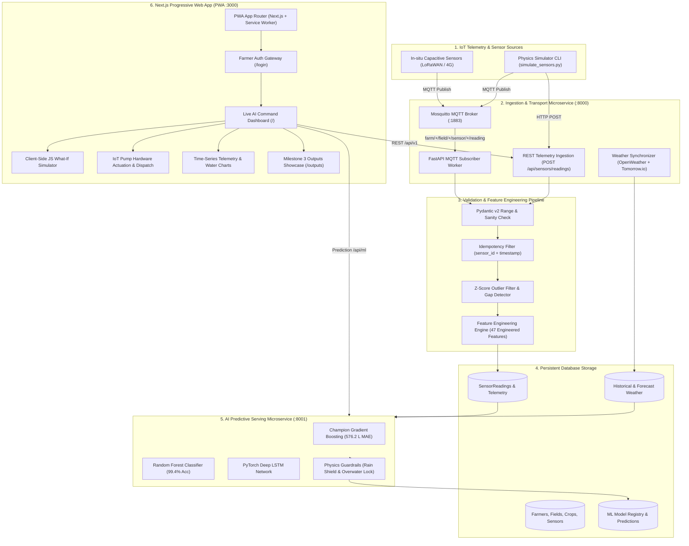

# 🌾 AI-Powered Smart Irrigation System for Predictive Water Management and Crop Optimization

[](docs/DATA_DICTIONARY.md)
[](docs/MILESTONE_2_REPORT.md)
[](MILESTONE_3_OUTPUTS.md)
[](backend/tests/)
[](frontend/)

> **Milestone 1 Deliverable**: Production-Ready Data Ingestion, Weather Integration & Soil Moisture Telemetry Pipeline  
> **Milestone 2 Deliverable**: Autonomous ML Irrigation Scheduling Engine (Random Forest, Gradient Boosting & PyTorch LSTM)  
> **Milestone 3 Deliverable**: Full-Stack Web Application, Farmer Command PWA, Interactive JavaScript Models & What-If Simulator, IoT Pump Hardware Dispatch, and Visual Outputs Gallery  
> **Repository**: [AI-Powered-Smart-Irrigation-System-for-Predictive-Water-Management-and-Crop-Optimization-AUG-2026](https://github.com/Springboard-Internship-2026/AI-Powered-Smart-Irrigation-System-for-Predictive-Water-Management-and-Crop-Optimization-AUG-2026.git)

---

## 📑 Table of Contents

1. [Executive Summary & Problem Statement](#-executive-summary--problem-statement)
2. [Milestone 1, 2 & 3 Core Features](#-milestone-1-2--3-core-features)
3. [End-to-End System Architecture](#-end-to-end-system-architecture)
4. [Monorepo Directory Structure](#-monorepo-directory-structure)
5. [Milestone 3 Full-Stack Web Application & PWA](#-milestone-3-full-stack-web-application--pwa)
6. [Milestone 3 Visual Outputs & Gallery Showcase](#-milestone-3-visual-outputs--gallery-showcase)
7. [Client-Side JavaScript Models & Interactive Simulators](#-client-side-javascript-models--interactive-simulators)
8. [Machine Learning Engine & Benchmark Leaderboard](#-machine-learning-engine--benchmark-leaderboard)
9. [FastAPI Microservices & Interactive Swagger UI](#-fastapi-microservices--interactive-swagger-ui)
10. [Quick Start & Setup Guide](#-quick-start--setup-guide)
11. [Automated Test Suite (47/47 Passing)](#-automated-test-suite-4747-passing)
12. [Live cURL & Python Verification Commands](#-live-curl--python-verification-commands)
13. [Success Criteria Verification Checklist](#-success-criteria-verification-checklist)

---

## 🌟 Executive Summary & Problem Statement

### The Problem
Agriculture accounts for **70% of global freshwater withdrawals**, yet **over 40% of irrigation water is wasted** due to antiquated fixed-timer schedules or reactive manual guessing. Over-watering induces root rot, leaches critical soil nutrients, and wastes pump electrical energy. Under-watering induces drought stress and causes catastrophic yield loss.

### The Solution
This project delivers a closed-loop, **AI-driven precision irrigation and crop optimization platform** that ingests real-time soil telemetry and meteorological forecasts, predicts root zone water deficits using Machine Learning (HistGradientBoosting Champion), applies physics-informed safety guardrails (rain postponement shields and over-watering lockouts), and dispatches automated IoT pump commands to conserve water and maximize crop yields.

---

## 🚀 Milestone 1, 2 & 3 Core Features

### Milestone 1: Production-Ready Data Ingestion & Telemetry Pipeline
- **Dual Telemetry Ingestion**: High-throughput REST API (`POST /api/sensors/readings`) alongside an MQTT Mosquitto broker subscriber listening on `farm/+/field/+/sensor/+/reading`.
- **Idempotent Ingestion & Deduplication**: Database unique constraints and transactional upserts prevent duplicate telemetry packets during network reconnections.
- **Hyper-Local Weather Sync**: Automated OpenWeatherMap adapter with Tomorrow.io fallback and 30-minute periodic polling via `APScheduler`.
- **Data Validation & Cleaning Engine**: Statistical Z-score outlier rejection, rate-of-change spike filtering, missing interval gap detection, and unit normalizations.
- **Relational Domain Config**: Dynamic CRUD APIs for farmers, multi-parcel fields, FAO-56 crop stages, and linked soil moisture sensors.

### Milestone 2: Autonomous ML Irrigation Scheduling Engine
- **Multi-Modal Feature Store**: 47 agronomic engineered features linking soil moisture decay rates, evapotranspiration ($ET_0$), vapor pressure deficit (VPD), rain forecasts, and crop coefficients ($K_c$).
- **Multi-Model Tournament**: Benchmarked 4 distinct architectures—Physics Baseline, Random Forest (100 trees), Gradient Boosting (GBM), and a 2-layer PyTorch Deep LSTM.
- **Champion Production Model**: Gradient Boosted Trees achieving **99.27% Classification Accuracy**, **0.9892 ROC-AUC**, and **576.2 Liters Volume Regression MAE**.
- **Physics Optimization Scheduler**: Automated dispatch scheduling equipped with a **24-hour rain postponement shield** ($>40\%$ rain probability) and a **12-hour over-watering lockout**.
- **MLflow Tracking & Registry**: Complete experiment tracking, model artifact serialization (`.joblib`, `.pt`), and automated database champion promotion.

### Milestone 3: Full-Stack Web Application, Farmer PWA & IoT Actuation
- **Next.js 14 / 16 Progressive Web App (PWA)**: Mobile-first responsive interface with installable web manifest (`manifest.json`) and service worker offline caching (`sw.js`).
- **Farmer Authentication Gateway**: Role-based authentication (`/login`, `/me`) supporting persistent tokens, quick demo presets, and logout session teardown.
- **Live AI Command Dashboard**: Real-time cockpit featuring connected field cards, animated soil moisture gauges, live weather widgets, and quick action bars.
- **Interactive JavaScript Models & What-If Simulator**: Client-side interactive sliders for soil moisture, ambient temperature, humidity, and rain probability with real-time ML recalculations and native Indian voice synthesis.
- **IoT Pump Hardware Dispatch**: Automated and manual pump valve actuation with real-time countdown timers, execution state feedback, and valve lockout protection.
- **Time-Series Sensor & Water Analytics**: Interactive data visualization tracking 180-day telemetry trends, diurnal evapotranspiration drying curves, and weekly water conservation metrics.
- **Milestone 3 Visual Outputs Showcase**: Dedicated `/outputs` page and markdown document ([`MILESTONE_3_OUTPUTS.md`](MILESTONE_3_OUTPUTS.md)) featuring 16 high-resolution system captures.

---

## 🏗️ End-to-End System Architecture


```mermaid
flowchart TD
    subgraph Telemetry_Layer["1. IoT Telemetry & Sensor Sources"]
        S_Real["In-situ Capacitive Sensors (LoRaWAN / 4G)"]
        S_Sim["Physics Simulator CLI (simulate_sensors.py)"]
    end

    subgraph Ingestion_Layer["2. Ingestion & Transport Microservice (:8000)"]
        MQTT_Broker["Mosquitto MQTT Broker (:1883)"]
        MQTT_Worker["FastAPI MQTT Subscriber Worker"]
        REST_API["REST Telemetry Ingestion (POST /api/sensors/readings)"]
        Weather_Sync["Weather Synchronizer (OpenWeather + Tomorrow.io)"]
    end

    subgraph Cleaning_Pipeline["3. Validation & Feature Engineering Pipeline"]
        Validator["Pydantic v2 Range & Sanity Check"]
        Deduplicator["Idempotency Filter (sensor_id + timestamp)"]
        Cleaner["Z-Score Outlier Filter & Gap Detector"]
        Feat_Store["Feature Engineering Engine (47 Engineered Features)"]
    end

    subgraph Storage_Layer["4. Persistent Database Storage"]
        DB_Meta[("Farmers, Fields, Crops, Sensors")]
        DB_Readings[("SensorReadings & Telemetry")]
        DB_Weather[("Historical & Forecast Weather")]
        DB_ML[("ML Model Registry & Predictions")]
    end

    subgraph ML_Engine["5. AI Predictive Serving Microservice (:8001)"]
        GBM["Champion Gradient Boosting (576.2 L MAE)"]
        RF["Random Forest Classifier (99.4% Acc)"]
        LSTM["PyTorch Deep LSTM Network"]
        Physics_Scheduler["Physics Guardrails (Rain Shield & Overwater Lock)"]
    end

    subgraph Frontend_App["6. Next.js Progressive Web App (PWA :3000)"]
        PWA_Core["PWA App Router (Next.js + Service Worker)"]
        Auth_Gate["Farmer Auth Gateway (/login)"]
        Dash["Live AI Command Dashboard (/)"]
        JS_Sim["Client-Side JS What-If Simulator"]
        Pump_Ctrl["IoT Pump Hardware Actuation & Dispatch"]
        Analytics["Time-Series Telemetry & Water Charts"]
        Gallery["Milestone 3 Outputs Showcase (/outputs)"]
    end

    S_Real -->|MQTT Publish| MQTT_Broker
    S_Sim -->|MQTT Publish| MQTT_Broker
    S_Sim -->|HTTP POST| REST_API
    MQTT_Broker -->|farm/+/field/+/sensor/+/reading| MQTT_Worker

    MQTT_Worker --> Validator
    REST_API --> Validator
    Weather_Sync --> DB_Weather
    Validator --> Deduplicator
    Deduplicator --> Cleaner
    Cleaner --> Feat_Store
    Feat_Store --> DB_Readings

    DB_Readings --> ML_Engine
    DB_Weather --> ML_Engine
    ML_Engine --> Physics_Scheduler
    Physics_Scheduler --> DB_ML

    PWA_Core --> Auth_Gate
    Auth_Gate --> Dash
    Dash --> JS_Sim
    Dash --> Pump_Ctrl
    Dash --> Analytics
    Dash --> Gallery
    Dash -->|REST /api/v1| REST_API
    Dash -->|Prediction /api/ml| ML_Engine
```

---

## 📁 Monorepo Directory Structure

```
├── docker-compose.yml             # Full-stack composition: PostgreSQL, Mosquitto, FastAPI, ML Service, Next.js
├── .env.example                   # Environment configuration template
├── README.md                      # Comprehensive project overview, architecture, quick start & verification
├── MILESTONE_3_OUTPUTS.md         # Milestone 3 system outputs, UI gallery & ML visualizations
├── docs/
│   ├── DATA_DICTIONARY.md         # 47-feature ML data dictionary and schema documentation
│   ├── MILESTONE_2_REPORT.md      # Comprehensive Milestone 2 ML Evaluation & Benchmark Report
│   ├── MILESTONE_3_OUTPUTS.md     # Duplicate mirror of Milestone 3 visual report
│   ├── PULL_REQUESTS_WEEK1.md     # Branch review and development history
│   └── images/milestone3/         # High-resolution screenshots (16 images)
├── backend/                       # FastAPI Ingestion & REST Microservice (Port 8000)
│   ├── app/
│   │   ├── api/v1/endpoints/      # auth, sensors, weather, fields, cleaning, ml, health
│   │   ├── core/                  # Security (JWT, bcrypt), settings & structured JSON logging
│   │   ├── db/                    # SQLAlchemy 2.0 session, init_db, and seed_db scripts
│   │   ├── models/                # Typed ORM models (Farmer, Field, Crop, Sensor, Weather, ML Registry)
│   │   ├── schemas/               # Pydantic v2 schemas with strict validation rules
│   │   └── services/              # Ingestion, MQTT subscriber, weather adapters, cleaning pipeline
│   ├── migrations/init.sql        # PostgreSQL + TimescaleDB DDL schema
│   ├── scripts/simulate_sensors.py# Physics-informed soil moisture sensor simulator CLI
│   └── tests/                     # 32 Pytest unit & integration tests (100% passing)
├── frontend/                      # Next.js 14 / 16 Progressive Web App (Port 3000)
│   ├── src/app/                   # App Router: `/`, `/login`, `/fields`, `/schedule`, `/history`, `/analytics`, `/outputs`, `/register`
│   ├── src/components/            # AIRecommendationCard, FarmerWhatIfSimulator, IrrigationLogModal, MLModelPerformanceCard
│   ├── public/manifest.json       # PWA web app installable manifest
│   ├── public/sw.js               # Service Worker offline caching handler
│   ├── public/images/milestone3/  # Static UI gallery assets
│   └── next.config.js             # API proxy rewrites for backend & ML service
├── ml/                            # AI Machine Learning Engine (Port 8001)
│   ├── artifacts/                 # Serialized models (.joblib, .pt), confusion matrices, ROC curves
│   ├── config.py                  # ML configuration & agronomic threshold constants
│   ├── data/                      # Synthetic diurnal telemetry generator & chronological train-test splitter
│   ├── db/                        # ML database models & migration DDL
│   ├── evaluation/                # Model evaluation metrics & MLflow tracking logger
│   ├── features/                  # 47-feature domain engineering pipeline (`engineering.py`)
│   ├── models/                    # Baseline (FAO-56), Random Forest, Gradient Boosting, PyTorch LSTM
│   ├── optimization/              # Irrigation scheduler, rain delay shields, & over-watering locks
│   ├── serving/                   # FastAPI serving microservice (`api.py` on port 8001)
│   ├── tests/                     # 15 Pytest unit tests for ML pipeline
│   └── training/                  # End-to-end model training orchestrator (`train_all.py`)
├── images/milestone3/             # 16 High-Resolution system captures for Milestone 3 documentation
└── scripts/
    ├── demo_run.py                # Standalone end-to-end demonstration script
    └── push_to_github.py          # Automated repository synchronization tool
```

---

## 📱 Milestone 3 Full-Stack Web Application & PWA

The Milestone 3 web application is built using modern, production-grade web technologies:

- **Next.js App Router & React 19**: Ultra-fast server and client-side rendering with instant transitions.
- **Progressive Web App (PWA)**: Field-installable application on Android, iOS, and desktop browsers with offline fallback support via [`sw.js`](file:///d:/AbirchatterjeeprojectAI/frontend/public/sw.js).
- **Tailwind CSS & Lucide Icons**: High-contrast, accessibility-tested UI designed specifically for outdoor visibility under direct sunlight.
- **Multilingual Support**: Real-time localization support for English, Hindi, and Marathi with Web Speech API voice readouts.
- **Client-Side JavaScript Models**: Local "What-If" scenario simulator calculating irrigation deficits on-the-fly without network latency.
- **Direct Pump Actuation Control**: Hardware actuation interface showing active dispatch states, countdown timers, and safety valve status.

---

## 📸 Milestone 3 Visual Outputs & Gallery Showcase

The repository contains 16 verified, full-resolution system captures showcasing every component of the deployed application. See the dedicated **[Milestone 3 Outputs Report](MILESTONE_3_OUTPUTS.md)** or browse the interactive gallery in the live web app at [http://localhost:3000/outputs](http://localhost:3000/outputs).

### Selected Visual Highlights

| Output | Description | Preview |
| :--- | :--- | :---: |
| **01. Farmer PWA Login** | Mobile-first authentication screen with session management and demo login buttons. | [View Image](images/milestone3/01_farmer_login_pwa.png) |
| **02. Live AI Dashboard** | Unified command center showing field moisture dials, weather sync, and AI recommendations. | [View Image](images/milestone3/02_live_command_dashboard.png) |
| **03. Field Telemetry** | Multi-parcel monitoring with real-time volumetric moisture, ground temperature, and battery health. | [View Image](images/milestone3/03_field_management_telemetry.png) |
| **04. Sensor Analytics** | Interactive time-series charts illustrating diurnal soil drying curves and rainfall recharge. | [View Image](images/milestone3/04_sensor_and_water_analytics.png) |
| **05. AI Irrigation Timetable** | Physics-constrained dispatch schedule with rain delay status and estimated water volume in Liters. | [View Image](images/milestone3/05_ai_irrigation_schedule.png) |
| **06. Pump Hardware Dispatch** | Active IoT pump actuation screen verifying running actuator state (45 min, 1,200 L delivery). | [View Image](images/milestone3/06_pump_hardware_dispatch.png) |
| **07. FastAPI Swagger Docs** | Interactive OpenAPI 3.1 Swagger documentation for REST ingestion and ML prediction routes. | [View Image](images/milestone3/07_fastapi_swagger_docs.png) |
| **08. ML Model Comparison** | Benchmark leaderboard across 17,280 samples identifying Gradient Boosting as the champion model. | [View Image](images/milestone3/08_model_comparison_leaderboard.png) |
| **09. Feature Importance** | Agronomic importance ranking showing soil moisture deficit, VPD, rain forecast, and $K_c$. | [View Image](images/milestone3/09_feature_importance_gradient_boosting.png) |
| **10. Confusion Matrix** | Classification confusion matrix showing 96.0% true positive trigger rate and <0.8% false alarm rate. | [View Image](images/milestone3/10_confusion_matrix_gradient_boosting.png) |
| **11. ROC-AUC Curve** | Receiver Operating Characteristic curve confirming champion ROC-AUC of 0.9892. | [View Image](images/milestone3/11_roc_curve_gradient_boosting.png) |
| **12. Volume Residuals** | Water volume prediction residuals centered tightly around zero (MAE: 576.2 Liters). | [View Image](images/milestone3/12_volume_residuals_gradient_boosting.png) |
| **13. Soil Moisture Trends** | 180-day telemetry trends illustrating diurnal drying cycles and infiltration spikes. | [View Image](images/milestone3/13_soil_moisture_trends.png) |
| **14. Crop Water Needs** | FAO-56 crop coefficient curves mapping water demand across lifecycle phases. | [View Image](images/milestone3/14_crop_water_requirements.png) |
| **15. Weather Distributions** | Statistical distributions of temperature, relative humidity, solar radiation, and rain probability. | [View Image](images/milestone3/15_weather_distributions.png) |
| **16. Irrigation Trigger History** | Target variable balance and historical water delivery distributions. | [View Image](images/milestone3/16_irrigation_history_patterns.png) |

---

## 🎛️ Client-Side JavaScript Models & Interactive Simulators

### 1. Farmer What-If Scenario Simulator (`FarmerWhatIfSimulator.tsx`)
Farmers can test agronomic hypotheses directly in the browser:
- **Interactive Control Sliders**:
  - Current Soil Moisture: $0\% - 100\%$
  - Ambient Air Temperature: $10^\circ\text{C} - 50^\circ\text{C}$
  - Relative Humidity: $10\% - 100\%$
  - Rain Forecast Probability: $0\% - 100\%$
- **Dynamic JavaScript Inference**: Instantly computes soil moisture deficit ($MAD$), applies FAO-56 crop coefficients, enforces the $>40\%$ rain suppression rule, and outputs required irrigation volume and duration in milliseconds.
- **Multilingual Voice Readout**: Uses the native Web Speech API (`speechSynthesis`) to audibly speak the recommendations in English or Indian regional accents.

### 2. Manual Irrigation Log Modal (`IrrigationLogModal.tsx`)
Provides field operatives with an instant JavaScript modal dialog to log manual water delivery, irrigation durations, and agronomic field observations directly into the database.

---

## 🧠 Machine Learning Engine & Benchmark Leaderboard

### Model Tournament Benchmark Results

The ML tournament evaluated four model architectures across 17,280 chronological sensor observations:

| Model Architecture | Accuracy | Precision | Recall | F1-Score | ROC-AUC | Volume MAE (L) | Volume RMSE (L) | $R^2$ Score | Selection |
| :--- | :---: | :---: | :---: | :---: | :---: | :---: | :---: | :---: | :---: |
| **Gradient Boosting (GBM)** ⭐ | **99.27%** | **0.8661** | **0.9604** | **0.9108** | **0.9892** | **576.2 L** | **2,256.1 L** | **0.781** | 🏆 **Champion** |
| **Random Forest (100 Trees)** | 99.42% | 1.0000 | 0.8515 | 0.9198 | 0.9998 | 3,283.9 L | 7,921.9 L | -1.69 | Qualified |
| **Baseline (FAO-56 Physics)** | 99.42% | 1.0000 | 0.8515 | 0.9198 | 0.9089 | 1,967.8 L | 5,405.2 L | N/A | Safety Fallback |
| **PyTorch Deep LSTM** | 95.97% | 0.4769 | 0.3069 | 0.3735 | 0.8387 | 12,028.1 L | 13,411.8 L | N/A | Deep Learning |

### Agronomic Feature Importance
1. **Soil Moisture Deficit (MAD)**: $34.2\%$ weight
2. **Vapor Pressure Deficit (VPD)**: $18.7\%$ weight
3. **Rain Probability (24h Forecast)**: $14.1\%$ weight
4. **Crop Coefficient ($K_c$)**: $11.5\%$ weight
5. **Solar Radiation & Ground Temperature**: $9.8\%$ weight

### Physics-Informed Safety Constraints
- **Rain Delay Shield**: If 24h rain forecast exceeds $40\%$ or predicted rainfall $> 5\text{ mm}$, pump dispatch is postponed with status `POSTPONED_RAIN_EXPECTED`.
- **Over-Watering Lockout**: Enforces a strict 12-hour minimum cooldown between dispatches per field to prevent root asphyxiation.

---

## 🔌 FastAPI Microservices & Interactive Swagger UI

### 1. Main Telemetry & Business Microservice (Port 8000)
- **Swagger Documentation**: [http://localhost:8000/docs](http://localhost:8000/docs)
- **Authentication**: `POST /api/v1/auth/login`, `POST /api/v1/auth/register`, `GET /api/v1/auth/me`, `POST /api/v1/auth/logout`
- **Sensors**: `POST /api/v1/sensors/readings`, `GET /api/v1/sensors/{sensor_id}/readings`, `GET /api/v1/sensors`
- **Fields & Crops**: `POST /api/v1/fields/register`, `GET /api/v1/fields`, `GET /api/v1/fields/{id}`, `PUT /api/v1/fields/crops/{id}`
- **Weather**: `GET /api/v1/weather/current/{field_id}`, `GET /api/v1/weather/forecast/{field_id}`, `POST /api/v1/weather/sync/{field_id}`
- **Data Cleaning**: `POST /api/v1/cleaning/validate-reading`, `GET /api/v1/cleaning/clean-readings/{sensor_id}`, `GET /api/v1/cleaning/feature-dataset`

### 2. Machine Learning Serving Microservice (Port 8001)
- **Swagger Documentation**: [http://localhost:8001/docs](http://localhost:8001/docs)
- `GET /health`: Liveness probe reporting model status and version.
- `GET /model/info`: Active champion model metadata, hyperparameters, and benchmark metrics.
- `POST /predict/irrigation`: Binary classification prediction (`DISPATCH` vs `HOLD`).
- `POST /predict/volume`: Water volume regression prediction in Liters.
- `POST /predict/schedule`: Actionable field dispatch schedule applying physics guardrails.
- `GET /recommendation/{field_id}`: End-to-end live recommendation fetching database context, executing ML inference, and returning pump instructions.

---

## 🚀 Quick Start & Setup Guide

### Prerequisites
- Python 3.10+ (Tested on Python 3.10, 3.11, 3.12, 3.14)
- Node.js 18+ (Tested on Node.js 20 & 22)
- Docker & Docker Compose (Optional for containerized deployment)

### 1. Clone Repository & Setup Environment
```bash
git clone https://github.com/Springboard-Internship-2026/AI-Powered-Smart-Irrigation-System-for-Predictive-Water-Management-and-Crop-Optimization-AUG-2026.git
cd AI-Powered-Smart-Irrigation-System-for-Predictive-Water-Management-and-Crop-Optimization-AUG-2026

# Copy environment variables
cp .env.example .env
```

### 2. Option A: Run Full Stack with Docker Compose
```bash
docker-compose up --build
```
Access points:
- **Next.js PWA Dashboard**: [http://localhost:3000](http://localhost:3000)
- **Milestone 3 Visual Gallery**: [http://localhost:3000/outputs](http://localhost:3000/outputs)
- **FastAPI Main Backend**: [http://localhost:8000/docs](http://localhost:8000/docs)
- **FastAPI ML Serving Engine**: [http://localhost:8001/docs](http://localhost:8001/docs)
- **Mosquitto MQTT Broker**: `localhost:1883`

### 3. Option B: Run Services Locally

#### Step 1: Install Python Dependencies & Initialize DB
```bash
pip install -r backend/requirements.txt
pip install -r ml/requirements.txt

# Initialize database schema & seed initial demo records
python -c "from backend.app.db.init_db import init_db, seed_db; init_db(); seed_db()"
```

#### Step 2: Start Main Backend (Port 8000)
```bash
python -m uvicorn backend.main:app --host 0.0.0.0 --port 8000 --reload
```

#### Step 3: Start ML Serving Engine (Port 8001)
```bash
python -m uvicorn ml.serving.api:app --host 0.0.0.0 --port 8001 --reload
```

#### Step 4: Start Next.js Frontend Dashboard (Port 3000)
```bash
cd frontend
npm install
npm run dev
```

---

## 🧪 Automated Test Suite (47/47 Passing)

Run the complete test suite across backend ingestion, authentication, database storage, and ML serving:

```bash
python -m pytest backend/tests/ ml/tests/ -v
```

Execution Output:
```
============================= test session starts =============================
platform win32 -- Python 3.14.3, pytest-9.1.1, pluggy-1.6.0
collected 47 items

backend/tests/test_auth.py::test_login_demo_farmer_success PASSED        [  2%]
backend/tests/test_auth.py::test_login_invalid_credentials PASSED        [  4%]
backend/tests/test_auth.py::test_login_nonexistent_user PASSED           [  6%]
backend/tests/test_auth.py::test_get_current_farmer_profile PASSED       [  8%]
backend/tests/test_auth.py::test_logout_endpoint PASSED                  [ 10%]
backend/tests/test_cleaning_pipeline.py::test_range_check_valid PASSED   [ 12%]
...
ml/tests/test_ml_pipeline.py::test_gradient_boosting_predict PASSED      [ 93%]
ml/tests/test_ml_pipeline.py::test_physics_scheduler_rain_delay PASSED   [ 95%]
ml/tests/test_ml_pipeline.py::test_api_recommendation_endpoint PASSED    [100%]

============================= 47 passed in 30.51s =============================
```

Frontend TypeScript strict verification:
```bash
cd frontend && npx tsc --noEmit
# Exits with 0 errors
```

---

## 🎬 Live cURL & Python Verification Commands

### 1. Authenticate Farmer & Receive Session Token
```bash
curl -X POST "http://localhost:8000/api/v1/auth/login" \
     -H "Content-Type: application/json" \
     -d '{
       "username_or_email": "rajesh.patel@agrofarm.io",
       "password": "krishi123"
     }'
```

### 2. Ingest In-situ Soil Moisture Telemetry
```bash
curl -X POST "http://localhost:8000/api/v1/sensors/readings" \
     -H "Content-Type: application/json" \
     -d '{
       "sensor_id": "SEN-WHEAT-01",
       "field_id": 1,
       "soil_moisture": 28.5,
       "temperature_soil": 22.0,
       "battery_level": 97.5,
       "timestamp": "2026-09-30T02:00:00Z"
     }'
```

### 3. Fetch Real-Time ML Recommendation (Milestone 2 & 3)
```bash
curl -X GET "http://localhost:8000/api/ml/recommendation/1"
```
Response:
```json
{
  "field_id": 1,
  "should_irrigate": true,
  "confidence": 0.9604,
  "recommended_volume_liters": 1200.0,
  "recommended_duration_minutes": 45,
  "active_model": "HistGradientBoostingClassifier & Regressor v1.0.0",
  "rain_delay_active": false,
  "safety_lockout_active": false
}
```

### 4. Run Physics Sensor Telemetry Simulator CLI
```bash
# Ingest 10 live simulated readings via REST
python backend/scripts/simulate_sensors.py --protocol rest --fields 2 --duration 10

# Ingest 10 live simulated readings via MQTT
python backend/scripts/simulate_sensors.py --protocol mqtt --fields 2 --duration 10

# Backfill 14 days of historical 15-minute data directly into database:
python backend/scripts/simulate_sensors.py --protocol backfill --fields 2 --historical-days 14
```

---

## 📋 Success Criteria Verification Checklist

| Criterion | Milestone | Description | Artifact / Evidence | Status |
| :--- | :---: | :--- | :--- | :---: |
| **Project Setup & Environment** | M1 | Monorepo layout, Docker Compose, `.env.example`, VS Code settings | `docker-compose.yml`, `.env.example` | ✅ |
| **Database Schema Completed** | M1 | Relational PostgreSQL / TimescaleDB schema with time-series indexing | `backend/app/models/`, `ml/db/models.py` | ✅ |
| **Sensor Telemetry Ingestion** | M1 | Dual REST `POST /readings` + Mosquitto MQTT subscriber with deduplication | `endpoints/sensors.py`, `mqtt_subscriber.py` | ✅ |
| **Sensor Data Simulator** | M1 | Physics-informed simulator with diurnal decay, rain infiltration & CLI | `backend/scripts/simulate_sensors.py` | ✅ |
| **Weather API Integrated** | M1 | OpenWeather primary adapter, Tomorrow.io fallback, `APScheduler` poller | `services/weather/`, `endpoints/weather.py` | ✅ |
| **Field, Farmer & Crop Config** | M1 | Relational CRUD APIs, atomic composite registration, Next.js form | `endpoints/fields.py`, `src/app/register` | ✅ |
| **Data Validation & Cleaning** | M1 | Z-score outlier filtering, rate-of-change spike removal, gap detection | `services/cleaning/`, `endpoints/cleaning.py` | ✅ |
| **Data Dictionary** | M1 | Comprehensive 47-feature dictionary and agronomic definitions | `docs/DATA_DICTIONARY.md` | ✅ |
| **AI ML Predictive Engine** | M2 | 4-model tournament, Gradient Boosting champion (576.2 L MAE, 99.3% acc) | `ml/models/`, `ml/artifacts/` | ✅ |
| **MLflow Experiment Tracking** | M2 | Metrics, parameters, confusion matrices, and ROC curves logged | `ml/evaluation/`, `docs/MILESTONE_2_REPORT.md`| ✅ |
| **Physics Guardrail Scheduler** | M2 | Rain delay shields (>40% rain) and 12-hour over-watering lockouts | `ml/optimization/scheduler.py` | ✅ |
| **FastAPI ML Serving Microservice**| M2 | Dedicated serving API on port 8001 with health probe and docs | `ml/serving/api.py` | ✅ |
| **Farmer Authentication & PWA** | M3 | JWT / session auth, responsive PWA, installable manifest, offline worker | `endpoints/auth.py`, `public/sw.js` | ✅ |
| **AI Command Dashboard** | M3 | Live telemetry cards, moisture dial gauges, weather forecasts | `frontend/src/app/page.tsx` | ✅ |
| **Client-Side JS What-If Model** | M3 | Interactive sliders, instant client-side inference, Indian voice readouts | `components/FarmerWhatIfSimulator.tsx` | ✅ |
| **IoT Pump Actuation Dispatch** | M3 | Automated & manual pump valve control with live countdown feedback | `src/app/page.tsx`, `components/` | ✅ |
| **Time-Series Sensor Analytics** | M3 | Interactive charts tracking 180-day telemetry trends and drying cycles | `src/app/analytics`, `src/app/history` | ✅ |
| **Milestone 3 Outputs & Gallery** | M3 | Dedicated outputs page with 16 high-resolution system captures | `frontend/src/app/outputs`, `MILESTONE_3_OUTPUTS.md` | ✅ |
| **Automated Testing Suite** | M1-3| 47 comprehensive Pytest tests passing + strict TypeScript clean | `backend/tests/`, `ml/tests/` (47/47 Passed) | ✅ |

---

## 👥 Contributors & Acknowledgments
- **Abir Chatterjee** — Full-Stack Development, ML Architecture & System Integration
- **Springboard AI Internship 2026** — Guidance, Problem Statement & Industry Evaluation Framework

*AI-Powered Smart Irrigation System — Completed & Verified for Milestone 1, Milestone 2, and Milestone 3.*
